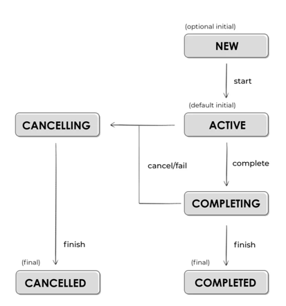

# 코틀린 코루틴

## 2부 코틀린 코루틴 라이브러리
> kotlinx.coroutines 라이브러리 살펴보기

## # 8장 잡과 자식 코루틴 기다리기

### 개요
- 부모-자식 관계의 특성 : 구조화된 동시성
- 자식이 부모로부터 컨텍스트를 물려받는 것은 코루틴 빌더의 가장 기본적인 특징이다.
- 이외에 구조화된 동시성의 중요한 특성 중 세 가지는 Job 컨텍스트와 관련이 있다.
  - 코루틴 취소, 상태 파악 등
```kotlin
private fun job_01() = runBlocking(CoroutineName("main")) {
    val name = this.coroutineContext[CoroutineName]?.name
    log("$name")
    
    launch { 
        // 자식 코루틴
        delay(1000)
        val name = this.coroutineContext[CoroutineName]?.name
        log("$name")
    }
}
```

### Job이란 무엇인가? - f_02

- Job은 수명을 가지고 있으며 취소 가능하다. Job의 수명은 상태로 나타낸다.
- 코루틴 컨텍스트보다 하위 개념이다. (CoroutineContext.Element)

### 코루틴 빌더는 부모의 잡을 기초로 자신들의 잡을 생성한다. - f_03, f_04, f_05
- 모든 코루틴 빌더는 자신만의 잡을 생성한다.
- 대부분의 코루틴 빌더는 잡을 반환하므로 어느 곳에서든 사용할 수 있다.
  - launch 반환 타입 : Job
  - async 반환 타입 : Deferred<T> - Job 인터페이스 구현
- Job은 코루틴 컨텍스트 이므로 아래와 같이 접근 가능하다.
  - coroutineContext.job.isActive 또는 coroutineContext[Job]
- Job은 코루틴이 상속하지 않는 유릴한 코루틴 컨텍스트이며, 이는 코루틴에서 아주 중요한 법칙이다.
- 모든 코루틴은 자신만의 Job을 생성하며 인자 또는 부모 코루틴으로부터 온 잡은 새로운 잡의 부모로 사용된다. - f_03
- 부모 잡은 자식 잡 모두를 참조할 수 있으며 자식 또한 부모를 참조할 수 있다. - f_04
- 새로운 Job context가 부모의 잡을 대체하면 구조화된 동시성의 작동 방식은 유효하지 않다. - f_05
  - 코루틴이 자식만의 독자적인 잡을 갖고 있으면 부모와 아무런 관계가 없다고 할 수 있다.
  - 부모-자식 관계가 없으면 구조화된 동시성을 잃게 되어 코루틴을 다루기 힘들어진다.

### 자식들 기다리기 - f_06
- 잡의 첫 번째 중요한 이점을 코루틴이 완료될 때까지 기다리는 데 사용될 수 있다는 점이다.
- 이를 위해 join 메서드를 사용한다. (job 상태가 Completed / Cancelled와 같은 마지막 상태에 도달할 때까지 기다리는 중단 함수)

### 잡 팩토리 함수 - f_07, f_08
- Job은 Job() 팩토리 함수를 사용하면 코루틴 없이도 Job을 만들 수 있다.
- 팩토리 함수로 생성하는 잡은 어떤 코루틴과도 연관되지 않으며, 컨텍스트로 사용될 수 있다.
- 흔한 실수 중 하나는 Job() 팩토리 함수를 사용해 잡을 생성하고, 다른 코루틴의 부모로 지정한 뒤 join을 호출하는 것이다.
  - 이렇게 되면 자식 코루틴이 모두 작업을 끝마쳐도 JOB은 여전히 액티브 상태에 있기 때문에 프로그램이 종료되지 않느다.
  - 팩토리 함수로 만들어진 잡은 다른 코루틴에 의해 여전히 사용될 수 있기 때문이다. (const 한 느낌?)
- 처음 보면 Job의 생성자를 호출한다고 생각할 수 있지만, Job은 인터페이스이며 Job()은 가짜 생성자이다.
  - public fun Job(parent: Job? = null): CompletableJob
    - complete(): Boolean - job을 완료하는데 사용한다. 모든 자식 코루틴은 작업이 완료될 때까지 실행된 상태를 유지하지만, 해당 job에서 새로운 코루틴이 시작될 수는 없다.
    - completeExceptionally(excetpion: Throwable): Boolean - 인자로 받은 예외로 잡을 완료시킨다.
- Job 함수의 인자로 부모 잡의 참조값을 전달할 수 있다. 이때 부모 잡이 취소되면 해당 잡 또한 취소된다.

<br>

## Reference
- 마르친 모스카와 - 코틀린 코루틴
